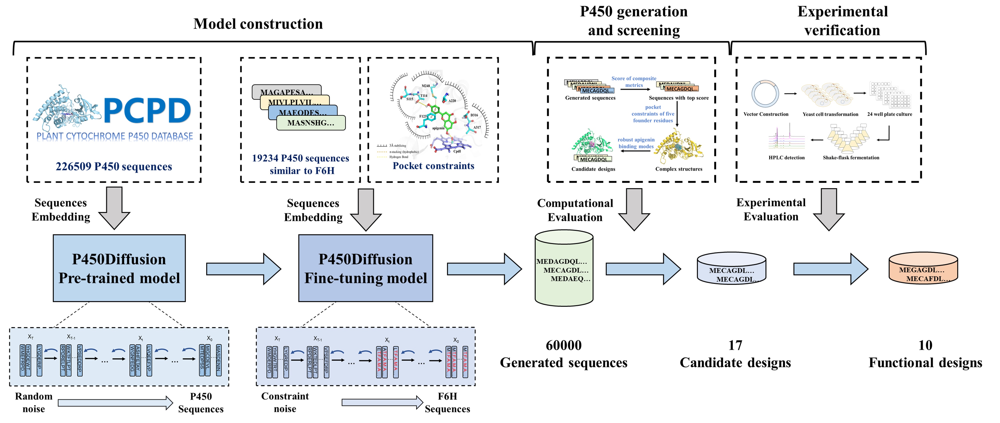

# P450Diffusion: A tool for designing P450 sequences based on diffusion model
## Overview
Although cytochrome P450 enzymes are the most versatile biocatalysts in nature, there is insufficient comprehension of the molecular mechanism underlying their functional innovation process. Here, by combining ancestral sequence reconstruction, reverse mutation assay and progressive forward accumulation, we identified five founder residues in the catalytic pocket of flavone 6-hydroxylase (F6H) and proposed a “three-point fixation” model to elucidate the functional innovation mechanisms ofP450s in nature. According to this design principle of catalytic pocket, we further developed a de novo diffusion model (P450Diffusion) to generate artificial P450s. Ultimately, among the 17 non-natural P450s we generated, ten designs exhibited significant F6H activity and six exhibited a 1.3- to 3.5-fold increase in catalytic capacity compared to the natural CYP706X1. This work not only explores the design principle of catalytic pockets of P450s, but also provides an insight into the artificial design of P450 enzymes with desired functions. For more details, please refer to our paper https://spj.science.org/doi/10.34133/research.0413
        
        
   

## Environment installation
The code has been tested under Python 3.9.13, with the following packages installed (along with their dependencies):
- torch==1.10.0
- numpy==1.23.4
- jupyter==1.0.0
- tqdm==4.64.1
- matplotlib==3.6.1
- ...
### Create a virtual environment and install packages
```
conda env create -f environment.yml
conda activate P450Diffusion
pip install torch==1.10.0+cu111 torchvision==0.11.0+cu111 torchaudio==0.10.0 -f https://download.pytorch.org/whl/torch_stable.html
```
## P450Diffusion Training 
1. We use pytorch-lighning to train the denosing diffusion model. Command line arguments can be passed to manipulate the training, details see P450Diffusion_training.ipynb
2. The datasets for the pre-trained and fine-tuned models are available at dataset/P450_All_Plant_Sequences_datasets.fasta and dataset/CYP706_Similarity_Sequences.fasta
3. The final model files obtained in this study are shown in model_files/P450Diffusion_pre_trained_model.pt and model_files/P450Diffusion_fine_tuning_model.pt
## Sampling Protein Sequences
1. P450Diffusion pretrained model sampling details in sampling_protein_sequences/P450Diffusion_pre_trained_model_generate_sequences.ipynb
2. P450Diffusion fine-tuning model sampling details in sampling_protein_sequences/P450Diffusion_fine_tuning_model_generate_sequences.ipynb
## Citation
If you find this repository useful, please cite our paper:
```
@article{wang2024cytochrome,
  title={Cytochrome P450 Enzyme Design by Constraining Catalytic Pocket in Diffusion model},
  author={Wang, Qian and Liu, Xiaonan and Zhang, Hejian and Chu, Huanyu and Shi, Chao and Zhang, Lei and Bai, Jie and Liu, Pi and Li, Jing and Zhu, Xiaoxi and Liu, Yuwan and Chen, Zhangxin and Huang, Rong and Chang, Hong and Liu, Tian and Chang, Zhenzhan and Cheng, Jian and Jiang, Huifeng},
  journal={Research},
  year={2024},
  publisher={AAAS}
}
```
